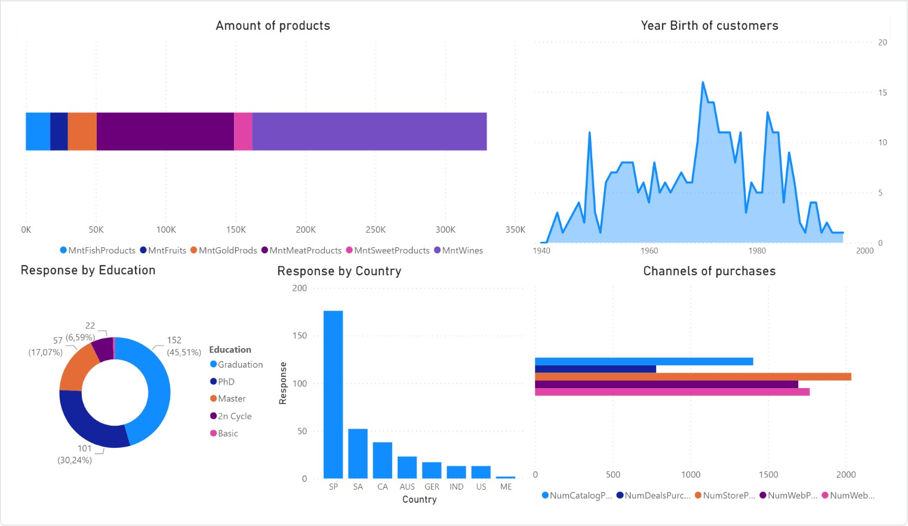

# Exploratory-Data-Analysis-of-marketing-campaigns

Successfully participated in the selection round for the role of Junior Data Analyst. 
Kaggle competition as a test task.   

The legend is: "You're a marketing analyst and you've been told by the Senior Marketing Manager that recent marketing campaigns have not been as effective as they were expected to be. You need to analyze the data set in order to understand this problem and propose data-driven solutions. You are required to solve the following questions to generate a report for your management".

To see the full project click on the <a href = "test1DmytoZhuk.ipynb">test1DmytoZhuk.ipynb </a>file.

---

## The data:

1. ID - Customer's unique identification
2. Year_Birth - Customer's birth year
3. Education - Customer's education
4. Marital_Status - Customer's marital status
5. Income - Customer's yearly household income
6. Kidhome - # of kids in household
7. Teenhome - # of teenagers in household
8. Dt_Customer - Date of customer's enrollment with the company
9. Recency - # of days since customer's last purchase
10. MntWines - Amount spent on wine in the last 2 years
11. MntFruits - Amount spent on fruit in the last 2 years
12. MntMeatProducts - Amount spent on meat in the last 2 years
13. MntFishProducts - Amount spent on fish in the last 2 years
14. MntSweetProducts - Amount spent on sweet products in the last 2 years
15. MntGoldProds - Amount spent on gold products in the last 2 years
16. NumDealsPurchases - # of purchases made with a discount
17. NumWebPurchases - # of purchases made on company website
18. NumCatalogPurchases - # of purchases made on the catalog
19. NumStorePurchases - # of purchase made in store
20. NumWebVisitsMonth - # of website visits in the last month
21. AcceptedCmp1 - 1 if customer accepted the offer in the 1st campaign, 0 otherwise
22. AcceptedCmp2 - 1 if customer accepted the offer in the 2nd campaign, 0 otherwise
23. AcceptedCmp3 - 1 if customer accepted the offer in the 3rd campaign, 0 otherwise
24. AcceptedCmp4 - 1 if customer accepted the offer in the 4th campaign, 0 otherwise
25. AcceptedCmp5 - 1 if customer accepted the offer in the 5th campaign, 0 otherwise
26. Response - 1 if customer accepted the offer in the last campaign, 0 otherwise
27. Complain - 1 if customer complained within the last 2 years
28. Country - Country where the customer is located (not from)

---
## PowerBI Dashboard: 

---
## Summary:
- The last campaign performed the best opposing to the previous campaigns. Second campaign is the worst.
- The most successful regions for marketing campaigns are: Spain, Saudi Arabia, Canada. ME region is the least successful.
- People who accepted the last campaign:
  1. Located in Spain
  2. Have Graduation, PhD
  3. Buy wine and meat products the most, fruits the least
  4. Buy through the store the most, with a discount the least
  5. Have 60000$ income in average
  6. Born in 1970 approximately
  7. Enroll with the company in August
  8. Usually, enroll on Monday
  9. Are usually single
- Customers with kids spend and purchase less.

## Data-driven solutions:
- It's better to use the same marketing campaign as the last campaign is the most successful. 
- Also, keep on focusing on wine and meat products.
- In order to attract new customers make promotions and discounts on Monday in August.
- Prioritize the Spanish market.
- Change web-site of the company as customers with high income are less likely to shop online on this web-site.
